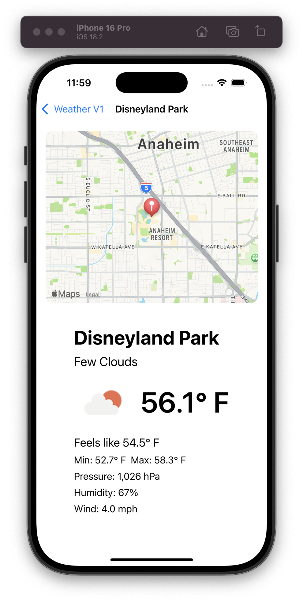
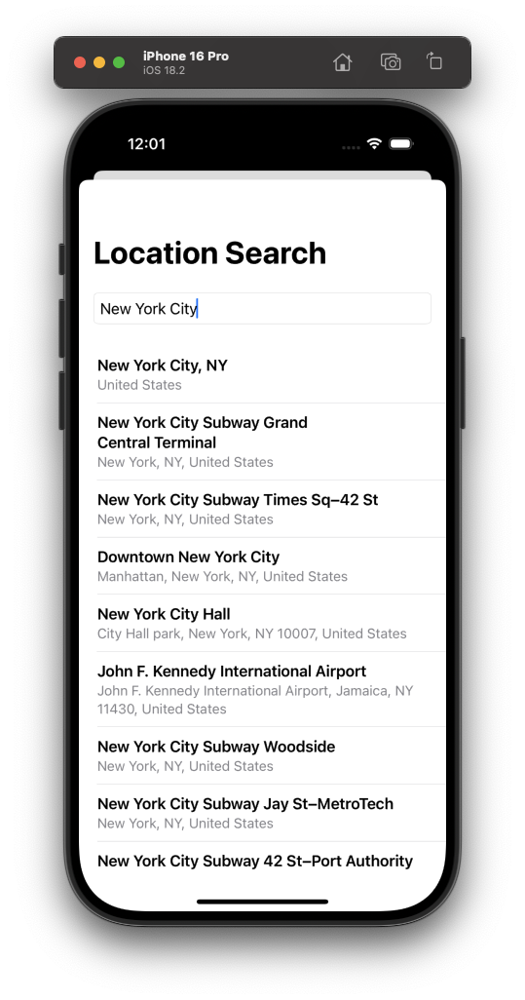
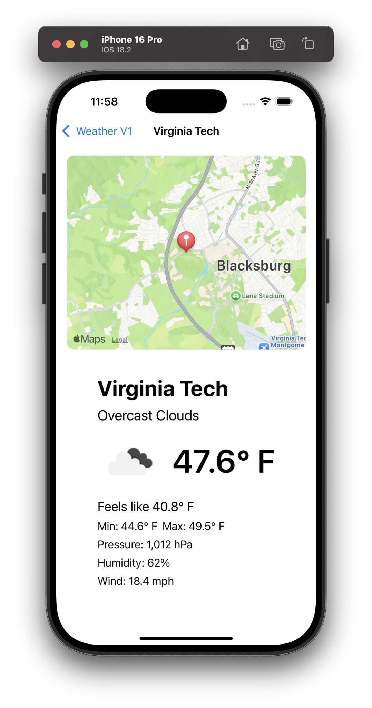

Here's an updated **README.md** including the **image paths** so they are correctly displayed in GitHub (or any markdown viewer that supports images).

---

# WeatherV1

A simple SwiftUI application for iOS that displays current weather information for any searched location. It integrates with the [OpenWeatherMap Current Weather API](https://openweathermap.org/current) and uses MapKit for location search.

## Overview

- **Language/Framework:** Swift (SwiftUI)
- **Platform:** iOS 16+ (or iOS 17+ if using newer APIs)
- **Architecture:** MV-ish pattern, using SwiftUI views and a separate location search service
- **Dependencies:** 
  - [OpenWeatherMap API](https://openweathermap.org/) (for weather data)
  - Apple’s [MapKit](https://developer.apple.com/documentation/mapkit) (for location search)

## Features

1. **Location Search**  
   - Users can search for any city or place using the built-in MapKit completer (`LocationSearchView`).
   - Results are displayed in a list, and tapping a result triggers a coordinate lookup.

2. **Weather Details**  
   - Once a location is selected, the app fetches current weather data (temperature, feels-like, humidity, wind, etc.) using OpenWeatherMap.
   - A `WeatherDetailView` shows weather information along with a map centered on the selected coordinate.

3. **SwiftUI Navigation**  
   - Utilizes `NavigationStack` (iOS 16+) or the older `NavigationView` with a `NavigationLink` to transition to the weather detail screen.

4. **Map Integration**  
   - Displays a `Map` (iOS 17+ or older MapKit approach) with a marker for the chosen location.

5. **Demo Screenshots & Video**  
   - The repository includes **images** (`DisneyLandWeatherImg`, `VirginiaTechWeatherImg`, etc.) demonstrating the UI, plus a **.mov recording** of the app in action.

---

## **Project Structure**
```
WeatherV1/
├── WeatherV1.xcodeproj
├── WeatherV1/
│   ├── ContentView.swift
│   ├── WeatherDetailView.swift
│   ├── LocationSearchView.swift
│   ├── LocationSearchService.swift
│   └── ...
├── DisneyLandWeatherImg.png
├── LocationSearchImg.png
├── VirginiaTechWeatherImg.png
├── WeatherV1Recording.mov
├── README.md
└── ...
```

- **`ContentView.swift`**  
  The main entry screen showing a “Search for a Location” button and a hidden navigation link.

- **`WeatherDetailView.swift`**  
  Displays the map and weather information for a selected location.

- **`LocationSearchView.swift`** & **`LocationSearchService.swift`**  
  Implements MapKit’s local search completer to find places and retrieve coordinates.

---

## **Getting Started**

### **1. Clone the Repository**
```bash
git clone https://github.com/your-username/WeatherV1.git
cd WeatherV1
```

### **2. Open in Xcode**
- Double-click `WeatherV1.xcodeproj` or open it from Xcode’s “Open” dialog.

### **3. Add Your OpenWeatherMap API Key**
- In `WeatherDetailView.swift` (or wherever you make the API call), find the line:
  ```swift
  let apiKey = "YOUR_API_KEY"
  ```
  Replace `"YOUR_API_KEY"` with your actual API key from [OpenWeatherMap](https://openweathermap.org/).

### **4. Build and Run**
- Choose an iOS Simulator or a real device and press **Run** (`Cmd + R`).

---

## **Usage**
- **Search for a location:** Tap **Search for a Location**, type a city/place, and select a search result.
- **View weather:** The app fetches weather data from OpenWeatherMap and displays the current temperature, feels-like, humidity, etc., plus a map pin at the chosen coordinates.

---

## **Screenshots / Demo**
### **Live Weather from Disneyland**


### **Searching for a Location**


### **Weather from Virginia Tech**


### **Video Walkthrough**
🎥 [Watch the demo]()

---

## **Requirements**
- **Xcode 14+** or **Xcode 15+** (for iOS 16+ or iOS 17 development)
- **Swift 5.7+**
- **iOS 16+** (if using newer `NavigationStack` and `.navigationDestination`)
- **iOS 17** (if using the latest `Map` initializer with content builder)

---

## **Contributing**
1. Fork the repository  
2. Create a new branch (`git checkout -b feature/my-feature`)  
3. Make changes and commit (`git commit -m 'Add some feature'`)  
4. Push to the branch (`git push origin feature/my-feature`)  
5. Open a Pull Request  

---

## **License**
This project is released under the [MIT License](LICENSE). Feel free to modify and distribute as needed.

---

**Enjoy building with SwiftUI and OpenWeatherMap!** If you have any questions or suggestions, please open an issue or submit a pull request. 🚀
